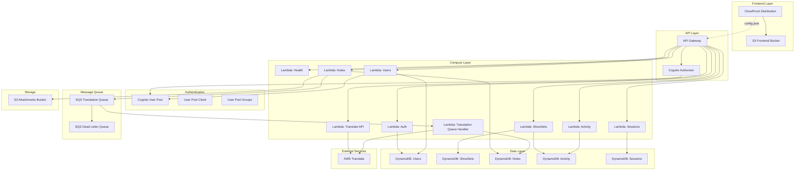
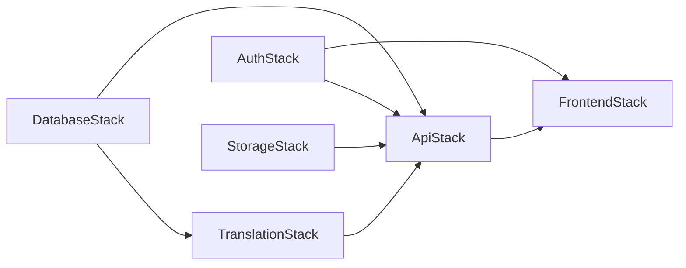

# UniSync AWS Infrastructure Overview

This document provides a comprehensive overview of the UniSync AWS CDK infrastructure, including all stacks, their relationships, and deployment architecture.

## Architecture Diagram



## Stacks Overview

UniSync infrastructure is deployed across 6 AWS CDK stacks:

| Stack | Description | Key Resources |
|-------|-------------|---------------|
| `UnisyncDatabaseStack` | Data persistence layer | 5 DynamoDB tables |
| `UnisyncAuthStack` | Authentication and authorization | Cognito User Pool, groups |
| `UnisyncTranslationStack` | Async translation service | SQS queue, Lambda handler |
| `UnisyncStorageStack` | File storage | S3 bucket for attachments |
| `UnisyncApiStack` | API endpoints and business logic | API Gateway, 8 Lambda functions |
| `UnisyncFrontendStack` | Static web hosting | S3, CloudFront |

## Stack Dependencies



### Dependency Details

1. **DatabaseStack** - No dependencies (foundational)
   - Creates all DynamoDB tables

2. **AuthStack** - No dependencies (foundational)
   - Creates Cognito User Pool and client

3. **TranslationStack** - Depends on: `DatabaseStack`
   - Needs Notes table for translation updates

4. **StorageStack** - No dependencies (foundational)
   - Creates S3 bucket for attachments

5. **ApiStack** - Depends on: `DatabaseStack`, `AuthStack`, `TranslationStack`, `StorageStack`
   - Needs all tables for CRUD operations
   - Needs User Pool for Cognito authorizer
   - Needs translation queue URL for async jobs
   - Needs attachments bucket for presigned URLs

6. **FrontendStack** - Depends on: `ApiStack`, `AuthStack`
   - Needs API URL for runtime config
   - Needs User Pool ID and Client ID for authentication

## Deployment

### Prerequisites

- AWS SSO profile: `AdministratorAccess-726966883566`
- Region: `ap-east-1` (Hong Kong)
- Node.js 22+
- pnpm

### Deploy All Stacks

```bash
# Build backend Lambda handlers first
pnpm --filter backend build

# Deploy all stacks
pnpm cdk:deploy

# Or deploy individually
cdk deploy UnisyncDatabaseStack
cdk deploy UnisyncAuthStack
cdk deploy UnisyncTranslationStack
cdk deploy UnisyncStorageStack
cdk deploy UnisyncApiStack
cdk deploy UnisyncFrontendStack
```

### Deployment Order

Due to dependencies, stacks deploy in this order:
1. `DatabaseStack` and `AuthStack` and `StorageStack` (parallel)
2. `TranslationStack`
3. `ApiStack`
4. `FrontendStack`

## Resource Naming Convention

All AWS resources are prefixed with `unisync-`:

- Tables: `unisync-users`, `unisync-showsets`, `unisync-notes`, `unisync-activity`, `unisync-sessions`
- Functions: `unisync-auth`, `unisync-showsets`, `unisync-notes`, etc.
- Queues: `unisync-translation-queue`, `unisync-translation-dlq`
- Buckets: `unisync-frontend-{account}-{region}`, `unisync-attachments-{account}-{region}`

## CloudFormation Exports

Each stack exports key values for cross-stack references:

| Export Name | Description |
|-------------|-------------|
| `unisync-users-table-name` | Users DynamoDB table name |
| `unisync-showsets-table-name` | ShowSets DynamoDB table name |
| `unisync-notes-table-name` | Notes DynamoDB table name |
| `unisync-activity-table-name` | Activity DynamoDB table name |
| `unisync-sessions-table-name` | Sessions DynamoDB table name |
| `unisync-user-pool-id` | Cognito User Pool ID |
| `unisync-user-pool-client-id` | Cognito User Pool Client ID |
| `unisync-user-pool-arn` | Cognito User Pool ARN |
| `unisync-translation-queue-url` | Translation SQS queue URL |
| `unisync-translation-queue-arn` | Translation SQS queue ARN |
| `unisync-api-url` | API Gateway base URL |
| `unisync-api-id` | API Gateway REST API ID |
| `unisync-frontend-domain` | CloudFront distribution domain |
| `unisync-distribution-id` | CloudFront distribution ID |
| `unisync-frontend-bucket` | Frontend S3 bucket name |
| `unisync-frontend-url` | Full frontend URL (https://) |
| `UnisyncAttachmentsBucketName` | Attachments S3 bucket name |

## Related Documentation

- [Stack Details](./stacks.md) - Detailed documentation of each stack
- [API Endpoints](./api-endpoints.md) - Complete API reference
- [Data Model](./data-model.md) - DynamoDB table schemas
