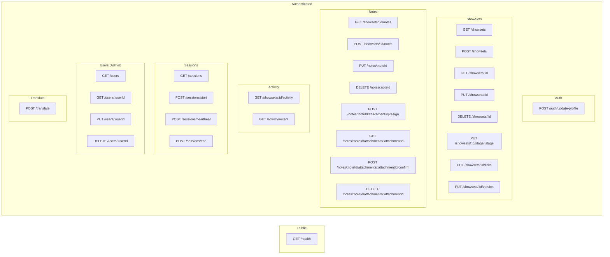

# UniSync API Endpoints

Complete reference for all API Gateway endpoints in the UniSync application.

## Base URL

```
https://{api-id}.execute-api.ap-east-1.amazonaws.com/v1
```

## Authentication

All endpoints except `/health` require Cognito JWT authentication via the `Authorization` header:

```
Authorization: Bearer <id_token>
```

## Endpoints Overview

| Category | Endpoints |
|----------|-----------|
| Health | 1 endpoint |
| Auth | 1 endpoint |
| ShowSets | 7 endpoints |
| Notes | 7 endpoints |
| Activity | 2 endpoints |
| Sessions | 4 endpoints |
| Users | 4 endpoints |
| Translate | 1 endpoint |

---

## Health Check

### GET /health

Check API health status. No authentication required.

**Handler:** `unisync-health` (inline Lambda)

**Response:**
```json
{
  "status": "healthy",
  "timestamp": "2024-01-15T10:30:00.000Z"
}
```

---

## Auth

### POST /auth/update-profile

Update the current user's profile.

**Handler:** `unisync-auth`

**Request Body:**
```json
{
  "name": "string (optional)",
  "preferredLang": "en | zh | zh-TW (optional)"
}
```

**Response:**
```json
{
  "success": true,
  "user": {
    "userId": "string",
    "email": "string",
    "name": "string",
    "role": "admin | bim_coordinator | 3d_modeller | 2d_drafter",
    "status": "active | deactivated",
    "preferredLang": "en | zh | zh-TW",
    "cognitoSub": "string",
    "canEditVersions": true,
    "createdAt": "ISO8601",
    "updatedAt": "ISO8601"
  }
}
```

---

## ShowSets

### GET /showsets

List all ShowSets.

**Handler:** `unisync-showsets`

**Query Parameters:**
- `area` (optional): Filter by area (`311` | `312`)

**Response:**
```json
{
  "showSets": [
    {
      "showSetId": "string",
      "area": "311 | 312",
      "scene": "string",
      "description": {
        "en": "string",
        "zh": "string",
        "zh-TW": "string"
      },
      "vmList": [{ "id": "string", "name": "string" }],
      "stages": {
        "screen": { "status": "string", "assignedTo": "string", "updatedBy": "string", "updatedAt": "ISO8601", "version": "string" },
        "structure": { "status": "string", "assignedTo": "string", "updatedBy": "string", "updatedAt": "ISO8601", "version": "string" },
        "integrated": { "status": "string", "assignedTo": "string", "updatedBy": "string", "updatedAt": "ISO8601", "version": "string" },
        "inBim360": { "status": "string", "updatedBy": "string", "updatedAt": "ISO8601" },
        "drawing2d": { "status": "string", "assignedTo": "string", "updatedBy": "string", "updatedAt": "ISO8601", "version": "string" }
      },
      "links": {
        "modelUrl": "string | null",
        "drawingsUrl": "string | null"
      },
      "screenVersion": 1,
      "revitVersion": 1,
      "drawingVersion": 1,
      "versionHistory": [],
      "createdAt": "ISO8601",
      "updatedAt": "ISO8601"
    }
  ]
}
```

### POST /showsets

Create a new ShowSet.

**Handler:** `unisync-showsets`

**Required Role:** `admin`, `bim_coordinator`

**Request Body:**
```json
{
  "showSetId": "string",
  "area": "311 | 312",
  "scene": "string",
  "description": {
    "en": "string",
    "zh": "string",
    "zh-TW": "string"
  },
  "vmList": [{ "id": "string", "name": "string" }]
}
```

### GET /showsets/{id}

Get a specific ShowSet by ID.

**Handler:** `unisync-showsets`

### PUT /showsets/{id}

Update a ShowSet's basic info.

**Handler:** `unisync-showsets`

**Required Role:** `admin`, `bim_coordinator`

**Request Body:**
```json
{
  "showSetId": "string (optional)",
  "area": "311 | 312 (optional)",
  "scene": "string (optional)",
  "description": {
    "en": "string",
    "zh": "string",
    "zh-TW": "string"
  },
  "vmList": [{ "id": "string", "name": "string" }]
}
```

### DELETE /showsets/{id}

Delete a ShowSet.

**Handler:** `unisync-showsets`

**Required Role:** `admin`

### PUT /showsets/{id}/stage/{stage}

Update a specific stage's status/assignment.

**Handler:** `unisync-showsets`

**Path Parameters:**
- `id`: ShowSet ID
- `stage`: `screen` | `structure` | `integrated` | `inBim360` | `drawing2d`

**Role Restrictions:**
| Role | Allowed Stages |
|------|----------------|
| admin | All |
| bim_coordinator | All |
| 3d_modeller | screen, structure, integrated |
| 2d_drafter | drawing2d |

**Request Body:**
```json
{
  "status": "not_started | in_progress | complete | on_hold | client_review | engineer_review | revision_required",
  "assignedTo": "string | null (optional)",
  "version": "string (optional)"
}
```

### PUT /showsets/{id}/links

Update ShowSet links (model URL, drawings URL).

**Handler:** `unisync-showsets`

**Request Body:**
```json
{
  "modelUrl": "string | null",
  "drawingsUrl": "string | null"
}
```

### PUT /showsets/{id}/version

Update ShowSet version numbers.

**Handler:** `unisync-showsets`

**Required Permission:** `canEditVersions: true`

**Request Body:**
```json
{
  "versionType": "screenVersion | revitVersion | drawingVersion",
  "version": 2,
  "reason": {
    "en": "Reason in English",
    "zh": "Reason in Chinese",
    "zh-TW": "Reason in Traditional Chinese"
  }
}
```

---

## Notes

### GET /showsets/{id}/notes

Get all notes for a ShowSet.

**Handler:** `unisync-notes`

**Path Parameters:**
- `id`: ShowSet ID

**Response:**
```json
{
  "notes": [
    {
      "noteId": "string",
      "showSetId": "string",
      "authorId": "string",
      "authorName": "string",
      "originalLang": "en | zh | zh-TW",
      "content": {
        "en": "string",
        "zh": "string",
        "zh-TW": "string"
      },
      "translationStatus": "pending | complete | failed",
      "attachments": [],
      "isRevisionNote": false,
      "createdAt": "ISO8601",
      "updatedAt": "ISO8601"
    }
  ]
}
```

### POST /showsets/{id}/notes

Create a new note for a ShowSet.

**Handler:** `unisync-notes`

**Request Body:**
```json
{
  "content": "string",
  "language": "en | zh | zh-TW"
}
```

### PUT /notes/{noteId}

Update a note's content.

**Handler:** `unisync-notes`

**Request Body:**
```json
{
  "content": "string"
}
```

### DELETE /notes/{noteId}

Delete a note.

**Handler:** `unisync-notes`

### POST /notes/{noteId}/attachments/presign

Get a presigned URL for uploading an attachment.

**Handler:** `unisync-notes`

**Request Body:**
```json
{
  "fileName": "string",
  "fileSize": 1024,
  "mimeType": "string"
}
```

**Response:**
```json
{
  "attachmentId": "string",
  "uploadUrl": "https://s3.presigned.url...",
  "expiresIn": 3600
}
```

### GET /notes/{noteId}/attachments/{attachmentId}

Get a presigned download URL for an attachment.

**Handler:** `unisync-notes`

**Response:**
```json
{
  "downloadUrl": "https://s3.presigned.url...",
  "fileName": "string",
  "mimeType": "string",
  "expiresIn": 3600
}
```

### POST /notes/{noteId}/attachments/{attachmentId}/confirm

Confirm an attachment upload was successful.

**Handler:** `unisync-notes`

### DELETE /notes/{noteId}/attachments/{attachmentId}

Delete an attachment.

**Handler:** `unisync-notes`

---

## Activity

### GET /showsets/{id}/activity

Get activity log for a specific ShowSet.

**Handler:** `unisync-activity`

**Path Parameters:**
- `id`: ShowSet ID

**Query Parameters:**
- `limit` (optional): Number of items to return (default: 50)
- `nextToken` (optional): Pagination token

**Response:**
```json
{
  "activities": [
    {
      "activityId": "string",
      "showSetId": "string",
      "userId": "string",
      "userName": "string",
      "action": "status_change | assignment | link_update | version_update | note_added | showset_created",
      "details": {
        "stage": "string",
        "from": "string",
        "to": "string"
      },
      "createdAt": "ISO8601"
    }
  ],
  "nextToken": "string | null"
}
```

### GET /activity/recent

Get recent activity across all ShowSets.

**Handler:** `unisync-activity`

**Query Parameters:**
- `limit` (optional): Number of items to return (default: 20)
- `days` (optional): Number of days to look back (default: 7)

---

## Sessions

Real-time presence tracking for collaborative awareness.

### GET /sessions

Get all active sessions.

**Handler:** `unisync-sessions`

**Response:**
```json
{
  "sessions": [
    {
      "userId": "string",
      "userName": "string",
      "showSetId": "string | null",
      "activity": "string",
      "startedAt": "ISO8601",
      "lastHeartbeat": "ISO8601",
      "expiresAt": 1705312200
    }
  ]
}
```

### POST /sessions/start

Start a new session.

**Handler:** `unisync-sessions`

**Request Body:**
```json
{
  "showSetId": "string (optional)",
  "activity": "string"
}
```

### POST /sessions/heartbeat

Update session heartbeat (keeps session alive).

**Handler:** `unisync-sessions`

**Request Body:**
```json
{
  "showSetId": "string (optional)",
  "activity": "string (optional)"
}
```

> Sessions expire 5 minutes after last heartbeat via DynamoDB TTL.

### POST /sessions/end

End the current session.

**Handler:** `unisync-sessions`

---

## Users (Admin Only)

User management endpoints. Most require `admin` role.

### GET /users

List all users.

**Handler:** `unisync-users`

**Required Role:** `admin`, `bim_coordinator`

**Response:**
```json
{
  "users": [
    {
      "userId": "string",
      "email": "string",
      "name": "string",
      "role": "admin | bim_coordinator | 3d_modeller | 2d_drafter",
      "status": "active | deactivated",
      "preferredLang": "en | zh | zh-TW",
      "cognitoSub": "string",
      "canEditVersions": true,
      "createdAt": "ISO8601",
      "updatedAt": "ISO8601"
    }
  ]
}
```

### GET /users/{userId}

Get a specific user.

**Handler:** `unisync-users`

**Required Role:** `admin`, `bim_coordinator`

### PUT /users/{userId}

Update a user.

**Handler:** `unisync-users`

**Required Role:** `admin`

**Request Body:**
```json
{
  "name": "string (optional)",
  "role": "admin | bim_coordinator | 3d_modeller | 2d_drafter (optional)",
  "preferredLang": "en | zh | zh-TW (optional)",
  "status": "active | deactivated (optional)",
  "canEditVersions": "boolean (optional)"
}
```

### DELETE /users/{userId}

Deactivate a user.

**Handler:** `unisync-users`

**Required Role:** `admin`

---

## Translate

### POST /translate

Synchronously translate text.

**Handler:** `unisync-translateapi`

**Request Body:**
```json
{
  "text": "string",
  "sourceLang": "en | zh | zh-TW",
  "targetLang": "en | zh | zh-TW"
}
```

**Response:**
```json
{
  "translatedText": "string",
  "sourceLang": "en | zh | zh-TW",
  "targetLang": "en | zh | zh-TW"
}
```

---

## Error Responses

All endpoints return errors in this format:

```json
{
  "error": "Error message",
  "code": "ERROR_CODE"
}
```

### Common Error Codes

| HTTP Status | Code | Description |
|-------------|------|-------------|
| 400 | `BAD_REQUEST` | Invalid request body or parameters |
| 401 | `UNAUTHORIZED` | Missing or invalid authentication |
| 403 | `FORBIDDEN` | Insufficient permissions |
| 404 | `NOT_FOUND` | Resource not found |
| 500 | `INTERNAL_ERROR` | Server error |

---

## Rate Limiting

API Gateway throttling is configured as:

| Limit Type | Value |
|------------|-------|
| Burst Limit | 100 requests |
| Rate Limit | 50 requests/second |

---

## API Endpoint Diagram


