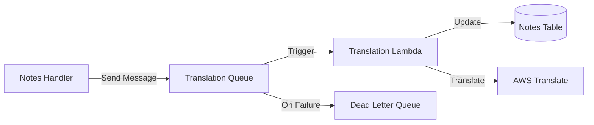
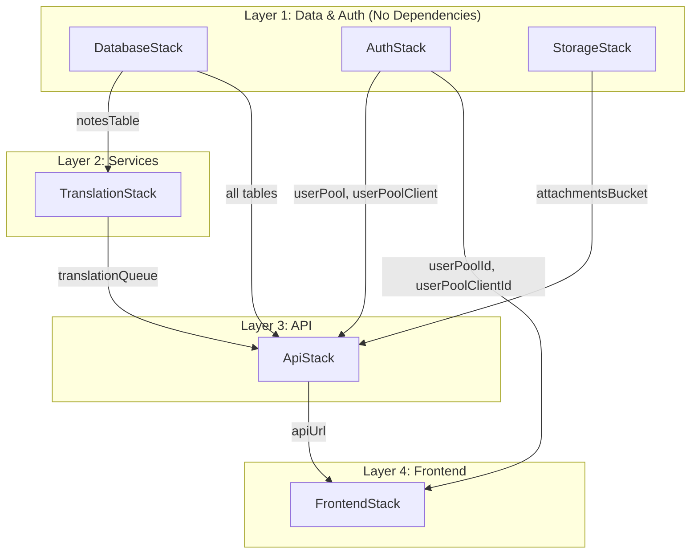

# UniSync CDK Stacks

Detailed documentation for each AWS CDK stack in the UniSync infrastructure.

## Table of Contents

- [DatabaseStack](#databasestack)
- [AuthStack](#authstack)
- [TranslationStack](#translationstack)
- [StorageStack](#storagestack)
- [ApiStack](#apistack)
- [FrontendStack](#frontendstack)

---

## DatabaseStack

**Stack ID:** `UnisyncDatabaseStack`
**File:** `infrastructure/lib/database-stack.ts`
**Dependencies:** None

### Purpose

Creates all DynamoDB tables for data persistence. This is a foundational stack with no dependencies on other stacks.

### Resources Created

| Resource | Type | Name |
|----------|------|------|
| Users Table | DynamoDB Table | `unisync-users` |
| ShowSets Table | DynamoDB Table | `unisync-showsets` |
| Notes Table | DynamoDB Table | `unisync-notes` |
| Activity Table | DynamoDB Table | `unisync-activity` |
| Sessions Table | DynamoDB Table | `unisync-sessions` |

### Configuration

All tables (except Sessions) share these settings:

| Property | Value |
|----------|-------|
| Billing Mode | PAY_PER_REQUEST (On-Demand) |
| Removal Policy | RETAIN |
| Point-in-Time Recovery | Enabled |

**Sessions Table** differences:
- Removal Policy: DESTROY (ephemeral data)
- TTL Attribute: `expiresAt`

### Global Secondary Indexes

| Table | GSI Name | Partition Key | Sort Key | Purpose |
|-------|----------|---------------|----------|---------|
| Users | `GSI1-email-index` | `GSI1PK` | `GSI1SK` | Email lookup |
| ShowSets | `GSI1-area-index` | `GSI1PK` | `GSI1SK` | Filter by area |
| Activity | `GSI1-date-index` | `GSI1PK` | `GSI1SK` | Recent activity queries |

### Exports

- `unisync-users-table-name`
- `unisync-showsets-table-name`
- `unisync-notes-table-name`
- `unisync-activity-table-name`
- `unisync-sessions-table-name`

---

## AuthStack

**Stack ID:** `UnisyncAuthStack`
**File:** `infrastructure/lib/auth-stack.ts`
**Dependencies:** None

### Purpose

Manages user authentication via Amazon Cognito. Creates the User Pool, client, and role-based groups.

### Resources Created

| Resource | Type | Name |
|----------|------|------|
| User Pool | Cognito User Pool | `unisync-user-pool` |
| User Pool Client | Cognito User Pool Client | `unisync-web-client` |
| Admin Group | Cognito User Pool Group | `unisync-admin` |
| BIM Coordinator Group | Cognito User Pool Group | `unisync-bim_coordinator` |
| 3D Modeller Group | Cognito User Pool Group | `unisync-3d_modeller` |
| 2D Drafter Group | Cognito User Pool Group | `unisync-2d_drafter` |

### User Pool Configuration

| Property | Value |
|----------|-------|
| Self Sign-Up | Disabled (admin creates users) |
| Sign-In Aliases | Email |
| Account Recovery | Email only |
| Removal Policy | RETAIN |

**Required Standard Attributes:**
- `email` (mutable)
- `fullname` (mutable)

**Custom Attributes:**
- `role` - User role (admin, bim_coordinator, 3d_modeller, 2d_drafter)
- `preferredLang` - Preferred language (en, zh, zh-TW)

### Password Policy

| Requirement | Value |
|-------------|-------|
| Minimum Length | 8 characters |
| Lowercase | Required |
| Uppercase | Required |
| Digits | Required |
| Symbols | Not required |

### User Pool Client Configuration

| Property | Value |
|----------|-------|
| Auth Flows | USER_PASSWORD_AUTH, USER_SRP_AUTH |
| Prevent User Existence Errors | Enabled |
| Access Token Validity | 1 hour |
| ID Token Validity | 1 hour |
| Refresh Token Validity | 30 days |

### User Groups

| Group Name | Description |
|------------|-------------|
| `unisync-admin` | Administrators with full access |
| `unisync-bim_coordinator` | BIM Coordinators |
| `unisync-3d_modeller` | 3D Modellers |
| `unisync-2d_drafter` | 2D Drafters |

### Exports

- `unisync-user-pool-id`
- `unisync-user-pool-client-id`
- `unisync-user-pool-arn`

---

## TranslationStack

**Stack ID:** `UnisyncTranslationStack`
**File:** `infrastructure/lib/translation-stack.ts`
**Dependencies:** `DatabaseStack` (Notes table)

### Purpose

Provides asynchronous translation of notes using AWS Translate via an SQS queue.

### Architecture



### Resources Created

| Resource | Type | Name |
|----------|------|------|
| Translation Queue | SQS Queue | `unisync-translation-queue` |
| Dead Letter Queue | SQS Queue | `unisync-translation-dlq` |
| Translation Handler | Lambda Function | `unisync-translation-handler` |

### Queue Configuration

**Main Queue:**

| Property | Value |
|----------|-------|
| Visibility Timeout | 60 seconds |
| Max Receive Count | 3 (before DLQ) |

**Dead Letter Queue:**

| Property | Value |
|----------|-------|
| Retention Period | 14 days |

### Lambda Configuration

| Property | Value |
|----------|-------|
| Runtime | Node.js 22.x |
| Handler | `index.handler` |
| Timeout | 30 seconds |
| Memory | 256 MB |
| Batch Size | 10 messages |
| Batching Window | 5 seconds |

### IAM Permissions

- DynamoDB: Read/Write on Notes table
- AWS Translate: `translate:TranslateText`

### Exports

- `unisync-translation-queue-url`
- `unisync-translation-queue-arn`

---

## StorageStack

**Stack ID:** `UnisyncStorageStack`
**File:** `infrastructure/lib/storage-stack.ts`
**Dependencies:** None

### Purpose

Provides S3 storage for note attachments with presigned URL support.

### Resources Created

| Resource | Type | Name |
|----------|------|------|
| Attachments Bucket | S3 Bucket | `unisync-attachments-{account}-{region}` |

### Bucket Configuration

| Property | Value |
|----------|-------|
| Block Public Access | ALL blocked |
| Encryption | S3-managed (SSE-S3) |
| Removal Policy | RETAIN |
| Auto Delete Objects | Disabled |

### CORS Configuration

| Property | Value |
|----------|-------|
| Allowed Origins | `*` |
| Allowed Methods | GET, PUT, POST |
| Allowed Headers | `*` |
| Max Age | 3000 seconds |

### Lifecycle Rules

| Rule | Status | Expiration |
|------|--------|------------|
| DeleteOldAttachments | Disabled | 365 days |

> Note: The lifecycle rule is disabled by default. Enable it if you want automatic expiration of old attachments.

### Exports

- `UnisyncAttachmentsBucketName`

---

## ApiStack

**Stack ID:** `UnisyncApiStack`
**File:** `infrastructure/lib/api-stack.ts`
**Dependencies:** `DatabaseStack`, `AuthStack`, `TranslationStack`, `StorageStack`

### Purpose

Creates the REST API with API Gateway and Lambda handlers for all business logic.

### Resources Created

| Resource | Type | Name |
|----------|------|------|
| REST API | API Gateway | `unisync-api` |
| Cognito Authorizer | API Gateway Authorizer | `unisync-cognito-authorizer` |
| Health Handler | Lambda Function | `unisync-health` |
| Auth Handler | Lambda Function | `unisync-auth` |
| ShowSets Handler | Lambda Function | `unisync-showsets` |
| Notes Handler | Lambda Function | `unisync-notes` |
| Activity Handler | Lambda Function | `unisync-activity` |
| Sessions Handler | Lambda Function | `unisync-sessions` |
| Users Handler | Lambda Function | `unisync-users` |
| Translate API Handler | Lambda Function | `unisync-translateapi` |

### API Gateway Configuration

| Property | Value |
|----------|-------|
| Stage Name | `v1` |
| Throttling Burst Limit | 100 requests |
| Throttling Rate Limit | 50 requests/second |

**CORS Configuration:**
- Allowed Origins: All
- Allowed Methods: All
- Allowed Headers: Content-Type, Authorization, X-Amz-Date, X-Api-Key, X-Amz-Security-Token

### Lambda Configuration (Default)

| Property | Value |
|----------|-------|
| Runtime | Node.js 22.x |
| Timeout | 30 seconds |
| Memory | 256 MB |

**Health Handler** (inline code):
- Timeout: 5 seconds
- Memory: 128 MB

### Environment Variables

All Lambda handlers receive:

| Variable | Description |
|----------|-------------|
| `USERS_TABLE` | Users DynamoDB table name |
| `SHOWSETS_TABLE` | ShowSets DynamoDB table name |
| `NOTES_TABLE` | Notes DynamoDB table name |
| `ACTIVITY_TABLE` | Activity DynamoDB table name |
| `SESSIONS_TABLE` | Sessions DynamoDB table name |
| `TRANSLATION_QUEUE_URL` | SQS translation queue URL |
| `USER_POOL_ID` | Cognito User Pool ID |
| `ATTACHMENTS_BUCKET` | S3 attachments bucket name |

### Special IAM Permissions

**Notes Handler:**
- SQS: `sqs:SendMessage` on Translation Queue
- S3: Read/Write on Attachments Bucket

**Users Handler:**
- Cognito: `AdminCreateUser`, `AdminUpdateUserAttributes`, `AdminDisableUser`, `AdminEnableUser`, `AdminAddUserToGroup`, `AdminRemoveUserFromGroup`, `AdminGetUser`

**Translate API Handler:**
- AWS Translate: `translate:TranslateText`

### Exports

- `unisync-api-url`
- `unisync-api-id`

---

## FrontendStack

**Stack ID:** `UnisyncFrontendStack`
**File:** `infrastructure/lib/frontend-stack.ts`
**Dependencies:** `ApiStack`, `AuthStack`

### Purpose

Hosts the React frontend application using S3 and CloudFront.

### Resources Created

| Resource | Type | Name |
|----------|------|------|
| Frontend Bucket | S3 Bucket | `unisync-frontend-{account}-{region}` |
| Origin Access Identity | CloudFront OAI | - |
| CloudFront Distribution | CloudFront Distribution | - |
| Config Deployment | S3 Deployment | - |

### S3 Bucket Configuration

| Property | Value |
|----------|-------|
| Block Public Access | ALL blocked |
| Removal Policy | DESTROY |
| Auto Delete Objects | Enabled |

### CloudFront Configuration

| Property | Value |
|----------|-------|
| Default Root Object | `index.html` |
| Viewer Protocol Policy | Redirect to HTTPS |
| Cache Policy | CACHING_OPTIMIZED |
| Allowed Methods | GET, HEAD, OPTIONS |
| Price Class | PRICE_CLASS_200 |

### SPA Error Handling

Custom error responses for SPA routing:

| HTTP Status | Response Status | Response Path | TTL |
|-------------|-----------------|---------------|-----|
| 403 | 200 | `/index.html` | 5 minutes |
| 404 | 200 | `/index.html` | 5 minutes |

### Runtime Configuration

A `config.json` file is deployed to the S3 bucket with:

```json
{
  "apiUrl": "<API Gateway URL>",
  "userPoolId": "<Cognito User Pool ID>",
  "userPoolClientId": "<Cognito Client ID>",
  "region": "<AWS Region>"
}
```

### Exports

- `unisync-frontend-domain` - CloudFront domain name
- `unisync-distribution-id` - CloudFront distribution ID
- `unisync-frontend-bucket` - S3 bucket name
- `unisync-frontend-url` - Full HTTPS URL

---

## Stack Relationship Diagram


